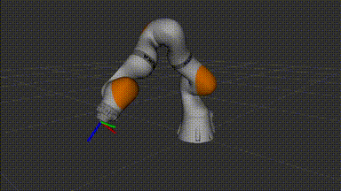
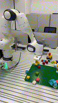
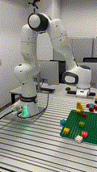

---
hide:
  # - navigation
  # - toc
---


# CRISP - **C**ompliant **R**OS2 Controllers for Learn**i**ng-Ba**s**ed Manipulation **P**olicies

*Authors: [Daniel San Jose Pro](https://danielsanjosepro.github.io)[^1], [Oliver Hausdörfer](https://oliver.hausdoerfer.de/)[^1], [Ralf Römer](https://ralfroemer99.github.io)[^1], Maximilian Dösch[^1], [Martin Schuck](https://amacati.github.io/) [^1] and Angela Schoellig [^1]*.

[^1]: The authors are with Technical University of Munich, Germany; TUM School of Computation, Information and Technology, Department of Computer Engineering, Learning Systems and Robotics Lab; Munich Institute of Robotics and Machine Intelligence.

> A collection of real-time, C++ controllers for compliant torque-based control for manipulators compatible with `ros2_control`. Developed for deploying high-level learning-based policies (VLA, Diffusion, ...) and teleoperation on your manipulator. It is compatible with any manipulator offering and effort interface.

_If you use this work, please cite it using the [bibtex](#citing) below._

Check the [controllers (CRISP controllers) :simple-github:](https://github.com/utiasDSL/crisp_controllers) , robot [demos (CRISP controllers demos) :simple-github:](https://github.com/utiasDSL/crisp_controllers_demos), a simple [python interface (CRISP_PY) :simple-github:](https://github.com/utiasDSL/crisp_py), and a [Gymnasium wrapper (CRISP_GYM) :simple-github:](https://github.com/utiasDSL/crisp_gym) for real-world experiments.

!!! info "Aloha gripper for Manipulators"
    Check out [aloha4franka](https://tum-lsy.github.io/aloha4franka/) for the gripper used in the videos.


| <video src="media/pap_demo.mp4" playsinline muted controls loop autoplay width="800"/> | <video src="media/policy.mp4" playsinline controls="true" loop="true" autoplay="true" width="800"/> |
|:--:|:--:|
| Robot teleoperated using a Follower-Leader system in [CRISP_GYM :simple-github:](https://github.com/utiasDSL/crisp_gym) | Diffusion Policy trained and deployed from the same demonstrations | 


|  |  |  |
|:--:|:--:|:--:|
| *Robot following a moving target, while base joint follows a sine curve* | *Simulated kinova robot with continous joints and nullspace control* | *Simulated iiwa robot* |

|  | |
|:--:|:--:|
| *Real robot following a target and being disturbed (contact) + null space control demonstration*  | *Demonstration using a cartesian controller teleoperated using Vicon tracking system (Speed x4)*| 

| <video src="media/teleoperation.mp4" controls="true" loop="true" autoplay="true" playsinline width="800"> |
|:--:|
| Teleoperation setup with activated force-torque feedback |


## Why?

Learning-based controllers, such as diffusion policies, deep reinforcement learning, and vision-action-models in general, typically output low-frequency or sporadic target poses, necessitating a low-level controller to track these references smoothly, especially in contact-rich environments.
While `ROS2` frameworks like `MoveIt` offer comprehensive motion planning capabilities, they are often unnecessarily complex for tasks requiring simple, real-time pose or joint servoing.

We present a set of lightweight, torque-based Cartesian and joint-space controllers implemented in C++ for `ros2_control`, compatible with any robot exposing an effort interface—a common standard among modern manipulators.
Our controllers incorporate friction compensation, joint limit avoidance, and error clipping, and have been validated on the Franka Robotics FR3 on hardware, and on various platforms in simulation.

Designed for fast integration and real-time control, our implementation lowers the barrier to deploying learning-based algorithms on `ROS2`-compatible platforms.

**Why the name "CRISP"**? "CRISP" reflects our design philosophy behind the package: a concise, to-the-point implementation for easy deployment and integration in other software stacks.

## Features
- 🐍 **Python interface** to move your ROS2 robot around without having to think about topics, spinning, and more ROS2 concepts but without loosing the powerful ROS2 API. Check [CRISP_PY](https://github.com/utiasDSL/crisp_py) for more information and examples.
- 🔁 **Gymnasium environment** with utilities to deploy learning-based policies and record trajectories in LeRobotFormat. Check [CRISP_GYM](https://github.com/utiasDSL/crisp_gym).
- ❓ **Demos** showcasing how to use the controller with FR3 of Franka Emika in single and bimanual setup. Check the [crisp_controller_demos](https://github.com/utiasDSL/crisp_controllers_demos).
- ⚙️ Dynamically and highly parametrizable: powered by the [`generate_parameter_library`](https://github.com/PickNikRobotics/generate_parameter_library) you can modify stiffness and more during operation.  
- 🤖 Operational Space Controller as well as Cartesian Impedance Controller for torque-based control.  
- 🚫 No MoveIt or complicated path-planning, just a simple C++ `ros2_controller`. Ready to use.  


## Citing

```bibtex
@misc{pro2025crispcompliantros2,
      title={CRISP - Compliant ROS2 Controllers for Learning-Based Manipulation Policies and Teleoperation}, 
      author={Daniel San José Pro and Oliver Hausdörfer and Ralf Römer and Maximilian Dösch and Martin Schuck and Angela P. Schöllig},
      year={2025},
      eprint={2509.06819},
      archivePrefix={arXiv},
      primaryClass={cs.RO},
      url={https://arxiv.org/abs/2509.06819}, 
}
```
