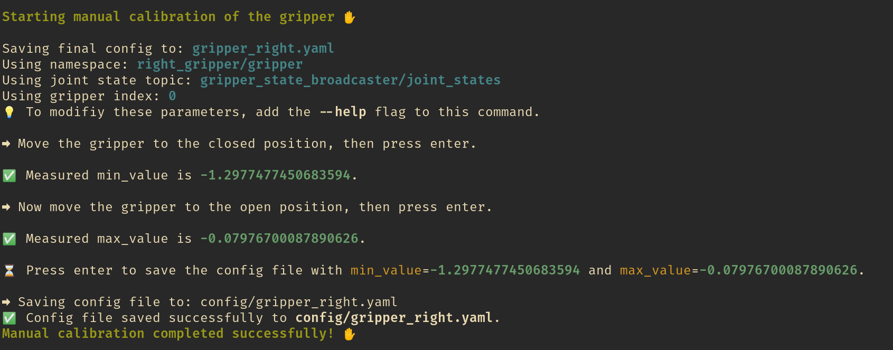

## How to calibrate a gripper

To grasp, make sure that you set the proper `min_value` and `max_value` in the config for the range in which the gripper joint moves.
All joint values are normalized between 0 (closed) and 1 (open) and the joint values vary from `min_value` and `max_value`.

To calibrate a gripper, use the [script](https://github.com/utiasDSL/crisp_py/blob/main/scripts/gripper_manual_calibration.py) provided in `crisp_py`:
```bash
python scripts/gripper_manual_calibration.py --help
```
The script will guide you in calibration procedure:


After this, control the gripper as follows:
```python
from crisp_py.gripper import Gripper, GripperConfig

gripper_config = GripperConfig.from_yaml("path/to/yaml")
# or gripper_config = GripperConfig(min_value=x.x, max_value=x.x)

gripper = Gripper(config=gripper_config)
gripper.open()  # equivalent to gripper.set_target(1.0)
gripper.close()  # equivalent to gripper.set_target(0.0)
gripper.set_target(0.5)
gripper.shutdown()

```
